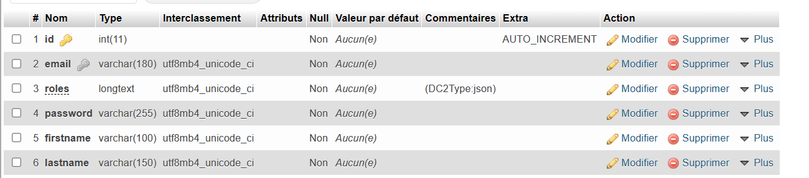

# Outils utilisés
* PHP : PHPSTORM
* MCD : POWER AMC 
* USE CASE : VISUAL PARADIGM ONLINE 
* Navigateur : Google Chrome / Microsoft Edge
* Base de données : PHPMYADMIN

# Langages et frameworks utilisés
* PHP (version 8.0)
* JAVASCRIPT 
* HTML/CSS
* SYMFONY (version 5.4.34) 

# Composants symfony 
* EasyAdmin
* Routing
* Hasher
* HTTP
* Bundle (ZenstruckFoundryBundle/DoctrineFixturesBundle)

# Composants ajoutés 
* Bootstrap
* Google materials icons

# Analyse 

* MCD :     

* Use Case :     


# Structure de la base 

* 
* Table Utilisateur : 
    * id : Généré automatiquement 
    * email : Utilisé pour la connexion 
    * lastName : Nom de famille de l'utilisateur 
    * firstName : Prénom de l'utilisateur
    * roles : Rôles attribués à l'utilisateur permettant l'accès à certaine page
    * password : Mot de passe de l'utilisateur (hashé) utilisé pour la connexion
* 
* Table Adresse : 
    * id : Généré automatiquement 
    * city : Ville de l'adresse 
    * postalCode : Code postal de l'adresse 
    * addressSupplement : Complément d'adresse 

# Données générées
*   Table Utilisateur  
    * * Email :  root@example.com
      * Mot de passe : test
      * Adresses liées :     
        1)  2 bis rue de Jessaint, 51000, Châlons-en-Champagne
        2) Chem. des Rouliers, 51100 , Reims
      * Roles : admin/user    
    
    * * Email :  user@example.com
      * Mot de passe : test
      * Adresses liées :     
        1)  10 rue de la brune, 02140 , Rogny
        2)  21 bis rue Henri Farman , Reims
      * Roles : user
    * * 10 Utilisateurs générés aléatoirement  
        Email de la forme : user-999@example.com
      * Mot de passe : test
      * Roles : user
* Exemple de données : 
* 
* Table Adresse
    * * City : Châlons-en-Champagne
      * PostalCode : 51000
      * addressSupplement : 2 bis rue de Jessaint
    * * City : Reims
      * PostalCode : 51100
      * addressSupplement : Chem. des Rouliers
    * * City : Rogny
      * PostalCode : 02140
      * addressSupplement : 10 rue de la brune 
    * * City : Reims
      * PostalCode : 51100
      * addressSupplement : 21 bis rue Henri Farman
    * * 10 adresses créées aléatoirement (non valides et ainsi sans météo) et attribuées à un utilisateur aléatoire    
* Exemple de données : 
* 
# Procédure d'installation 
1) Lancer l'instruction suivante pour récupérer les fichiers appartenant à composer  : 
```shell
composer install 
```
2) Configurer la base de données 
3) Lancer la commande suivante pour générer la base de données et les données
```shell
composer db 
``` 
4) Lancer le serveur 
```shell
symfony serve
``` 
5) Lancer une page et naviguer
    * http://localhost:8000/
    * http://localhost:8000/admin

# Problèmes rencontrés
* Problèmes liés à la suggestion grâce à la balise ``datalist`` qui n'avait aucun effet dans edge mais qui marchait totalement dans chrome
